# Prototype 流程：PM 需求 → preview → 前後端交接

`pm-to-preview` skill 的完整流程圖。**設計系統 repo 是單一來源**，`prototypes/` 永遠不搬進專案。

## 全流程

```mermaid
flowchart TD
    A["PM 口語描述需求<br/>（不填表、不給模板）"] --> B["① AI 回述結構化摘要<br/>元件 / 版面 / page or fragment / 專案名"]
    B -->|不對| A
    B -->|PM 點頭| C{"② 缺件三層門檻"}

    C -->|"第 1 層<br/>命中現有 x-pi 元件"| D["直接用"]
    C -->|"第 2 層<br/>現有 token 疊得出"| E["組合件<br/>page-scoped style ≤ 30 行<br/>handoff 標 ⚠️"]
    C -->|"第 3 層<br/>需 JS 行為或新視覺"| F["真缺件 → 4 欄提議<br/>停等 PM 審批"]

    F -->|同意新件| G["placeholder 頂替<br/>handoff 標 🆕"]
    F -->|改用現有| D
    F -->|擱置| H["留空位 + TODO<br/>handoff 底部擱置項"]

    D --> I["③ 產 prototype<br/>prototypes&#47;&lt;project&gt;&#47;"]
    E --> I
    G --> I
    H --> I

    I --> J["blade + fixtures<br/>零寫死資料"]
    J --> K["preview 驗證<br/>localhost:8100&#47;prototypes&#47;…<br/>回 200 + PM 看畫面"]
    K -->|要改| A
    K -->|PM 確認| L["④ 產兩份 handoff<br/>.scratch&#47;&lt;feature&gt;&#47;"]
    L --> M["⑤ 交接"]
```



## 交接（⑤ 展開）

```mermaid
flowchart TD
    S["設計系統 repo<br/>prototypes&#47;jobar&#47;<br/>（留在原地，不複製）"]

    S --> T["php scripts&#47;apply.php jobar member-register"]
    S --> U["fixtures&#47;*.php<br/>＝資料契約"]

    T --> FE["前端"]
    U --> BE["後端"]

    subgraph 前端流程
        FE --> FE1["composer require pi-tw&#47;pi-design-system"]
        FE1 --> FE2["SCSS entry @use<br/>vendor&#47;…&#47;resources&#47;scss&#47;index"]
        FE2 --> FE3["貼成專案 view<br/>resources&#47;views&#47;members&#47;register.blade.php"]
        FE3 --> FE4["改一處：@extends 換專案 layout"]
        FE4 --> FE5["讀 frontend-handoff.md<br/>補狀態 / 互動（⚠️ 待確認項）"]
    end

    subgraph 後端流程
        BE --> BE1["讀 backend-handoff.md<br/>型別 / 驗證 / API 意圖"]
        BE1 --> BE2["controller 產出<br/>與 fixture 同 key 結構的陣列"]
        BE2 --> BE3["加 route + validator<br/>錯誤訊息餵進 errors"]
    end

    FE5 --> Z["專案頁面上線<br/>view 吃 controller 資料"]
    BE3 --> Z
```



## Fragment 路線（slot 怎麼用）

上面那張交接圖是 **page 路線**（整頁新檔，貼進專案）。Fragment 是「頁面中一塊」，
要靠 slot marker 對位，多三個步驟：

```mermaid
flowchart TD
    P0["① 回述確認判定為 fragment"] --> P1["專案端在插入位置埋 marker<br/>&lt;!-- @pi-slot: member-list.filters --&gt;<br/>（必須是 HTML 註解）"]
    P1 --> P2["php scripts&#47;fetch-host.php &lt;project&gt; &lt;name&gt; &lt;url&gt;<br/>抓專案頁面 rendered HTML 當背景快照<br/>→ prototypes&#47;&lt;project&gt;&#47;_hosts&#47;&lt;name&gt;.html"]
    P2 --> P3["③ 寫 fragment blade<br/>開頭宣告 @piFragment manifest<br/>target &#47; slot &#47; host 三欄"]
    P3 --> P4["preview 把 fragment 注入快照的 marker 位置<br/>PM 看到的是坐在真實脈絡裡的樣子"]
    P4 --> P5["⑤ php scripts&#47;apply.php &lt;p&gt; &lt;n&gt; --output=patch<br/>--target=&lt;專案clone&gt;&#47;resources&#47;views&#47;…blade.php"]
    P5 --> P6["前端 git apply + review<br/>（腳本不直接改跨 repo 的檔）"]
```



### 三個硬性規則

1. **marker 必須是 HTML 註解**。`{{-- @pi-slot: x --}}` render 後就消失，`fetch-host.php`
   抓回的快照裡沒有錨點，fragment 無處可插。
2. **manifest 三欄都要給**（`target` / `slot` / `host`），缺了 preview 會退回「裸片段」並在畫面上寫原因。
3. **page 裡不要 `@include` fragment**。兩者是獨立的 prototype，page 只放 marker
   （檔名含 dot 的 fragment 本來也 include 不到 —— Blade 把 dot 當目錄分隔）。

### 同一個 marker 服務三件事

- `apply.php` 產 patch 時的插入位置（改 blade **原始碼**）
- preview 注入 fragment 的位置（改 **rendered HTML**）
- 「此位置有 prototype 在跑」的標記

### 現成範例

`prototypes/project-a/fragments/member-list.filters.blade.php`（manifest + fixture + 元件）
搭 `prototypes/project-a/pages/member-list.blade.php`（第 41 行的 marker）與
`prototypes/project-a/_hosts/members-index.html`（宿主快照）。

### 什麼時候該用 fragment 而不是 page

- 專案頁面**已經存在**，只是要加/改其中一塊 → fragment
- 整頁是新的 → page（不需要 marker、不需要快照）

## Blade 元件的 slot（另一回事）

`<x-slot:action>` 是 **Blade 原生語法**，用來填元件內部預留的洞，與上面的 `@pi-slot` 無關。
只有 `.meta.php` 的 `slots` 欄位列出來的洞才存在：

```blade
{{-- callout 有 default（內文）與 action（右側行動區）兩個 slot --}}
<x-pi::callout tone="info" icon="icon-info" title="已經有帳號了？">
    用原本的 Email 登入就能看到你的職缺收藏與應徵紀錄。
    <x-slot:action>
        <x-pi::button as="a" href="#" size="sm" variant="outline" tone="success">前往登入</x-pi::button>
    </x-slot:action>
</x-pi::callout>
```

其餘元件多數只有 `default` slot（button / checkbox / radio 的標籤文字）。
查法：`localhost:8100/components/<name>` 或 `resources/views/components/<name>.meta.php`。

## 三方各拿什麼

| 角色 | 拿什麼 | 來源 |
|---|---|---|
| PM | preview 網址 | `localhost:8100/prototypes/<project>/<name>` |
| 前端 | `apply.php` 輸出的 blade + `frontend-handoff.md` | page：貼成專案 view，換 layout<br/>fragment：`--output=patch` 產 diff → `git apply` |
| 後端 | `fixtures/` 的 key 結構 + `backend-handoff.md` | 照結構寫 controller |

## 為什麼 `prototypes/` 不搬進專案

| 東西 | 搬進專案的下場 |
|---|---|
| `@piFixture(...)` | 丟 `RuntimeException` —— fixtures 目錄是 preview 的 controller 在 render 前設的（`src/Prototype/FixtureLoader.php:44`） |
| `@extends('pi::layouts.preview')` | 吃到設計系統 preview 站的 layout，不是專案的 |
| 檔案位置 `prototypes/` | 不在 Laravel view 路徑內，`view('…')` 解不到 |

`.gitattributes` 的 `export-ignore` 也已把 `prototypes/` 排除出貨 —— `composer require` 抓不到它。
所以 `apply.php` 一定要跑：它負責刪掉 `@piFixture`、刪掉 prototype 專用註解、輸出可直接貼的 blade。

## 元件與 foundation 怎麼查

全部在同一個 preview（`cd preview && docker compose up -d && npm run dev`）：

| 看什麼 | 網址 |
|---|---|
| 三區入口 | `localhost:8100/` |
| Blade 元件（props / notes / 可跑範例） | `localhost:8100/components` |
| 全部 170 個 token（可搜尋、點擊複製） | `localhost:8100/foundation/tokens` |
| 250 個 icon | `localhost:8100/foundation/icons` |
| 單一 token 群組（色彩 / 字體 / 間距 / 圓角 / 陰影 / 動態 / 斷點） | `localhost:8100/foundation/<group>` |
| Prototype | `localhost:8100/prototypes` |

三區的清單都是掃檔生成 —— 加 token / 元件 / prototype 不需要改 preview。

> `preview-static/`（blade 化之前的 20 支靜態 HTML）已廢除，repo 根目錄也不再有 Vite。
